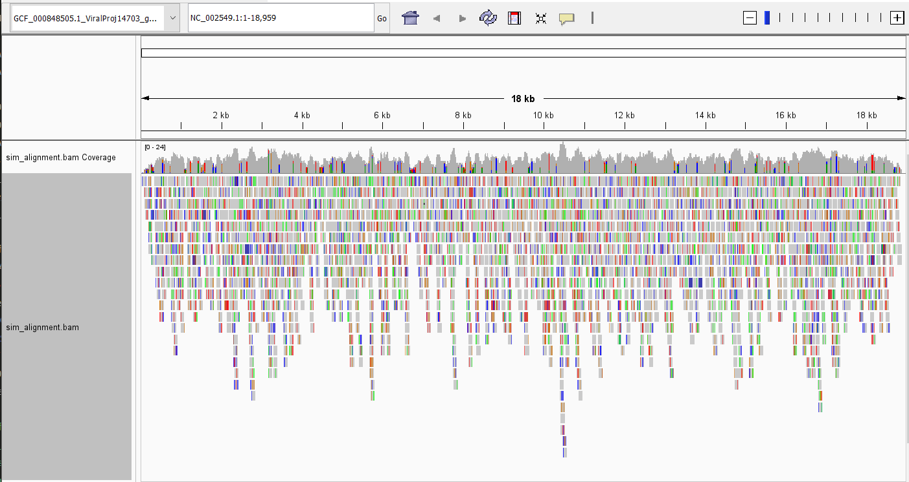
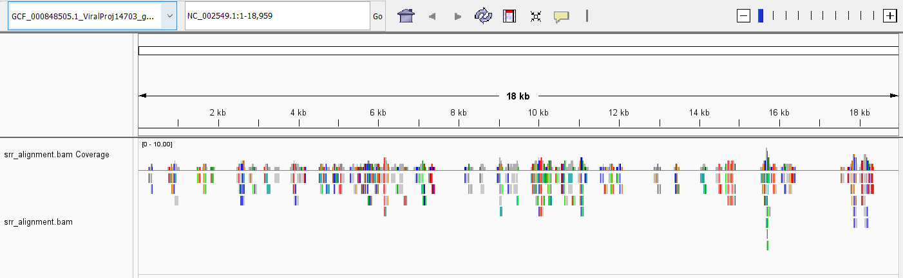

# Week 8: Generate a BAM alignment file


Makefile from hw_07 was used and targets for indexing and aligning added. The ```index``` target indexes the reference genome and ```align``` target pulls the simulated reads and reads from an SRR and aligns with ```bwa mem```. Summary statistics for each bam file (after indexing) are generated. 

Initially I did this with my previously used species, *Genlisea aureus*, but neither simulated nor SRR reads showed up aligned on IGV. I was unsure if my syntax was incorrect or there was some other error, so I tried an Ebola reference genome and SRR, and it aligned and showed up as depicted further below. In previous work I saw the *G. aureus* SRR available was awful, but that doesn't explain why the simulated were also not showing up in IGV. Maybe the reference genome itself is really messy or bad, but the simulated reads use that as reference so I still don't understand this problem. However, my Makefile does work appropriately for other species and SRRs. 

Because I was using the same attempted coverage for previous assignments of a bigger genome, the simulated coverage is much much higher than the one in the SRR. The SRR shows in the end a 55% of QC passed "properly paired" reads. 

#### Simulated reads

IGV: 



Stats: 

```
2000 + 0 in total (QC-passed reads + QC-failed reads)
2000 + 0 primary
0 + 0 secondary
0 + 0 supplementary
0 + 0 duplicates
0 + 0 primary duplicates
2000 + 0 mapped (100.00% : N/A)
2000 + 0 primary mapped (100.00% : N/A)
2000 + 0 paired in sequencing
1000 + 0 read1
1000 + 0 read2
2000 + 0 properly paired (100.00% : N/A)
2000 + 0 with itself and mate mapped
0 + 0 singletons (0.00% : N/A)
0 + 0 with mate mapped to a different chr
0 + 0 with mate mapped to a different chr (mapQ>=5)
```
#### SRR reads

IGV: 



Stats: 

```
207 + 0 in total (QC-passed reads + QC-failed reads)
200 + 0 primary
0 + 0 secondary
7 + 0 supplementary
0 + 0 duplicates
0 + 0 primary duplicates
151 + 0 mapped (72.95% : N/A)
144 + 0 primary mapped (72.00% : N/A)
200 + 0 paired in sequencing
100 + 0 read1
100 + 0 read2
110 + 0 properly paired (55.00% : N/A)
144 + 0 with itself and mate mapped
0 + 0 singletons (0.00% : N/A)
0 + 0 with mate mapped to a different chr
0 + 0 with mate mapped to a different chr (mapQ>=5)
```

