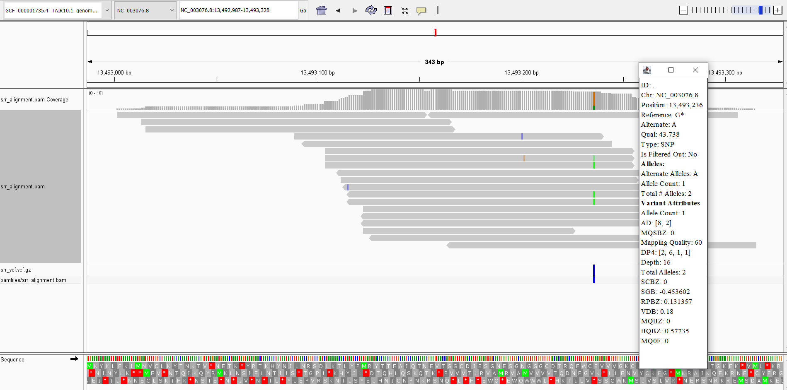
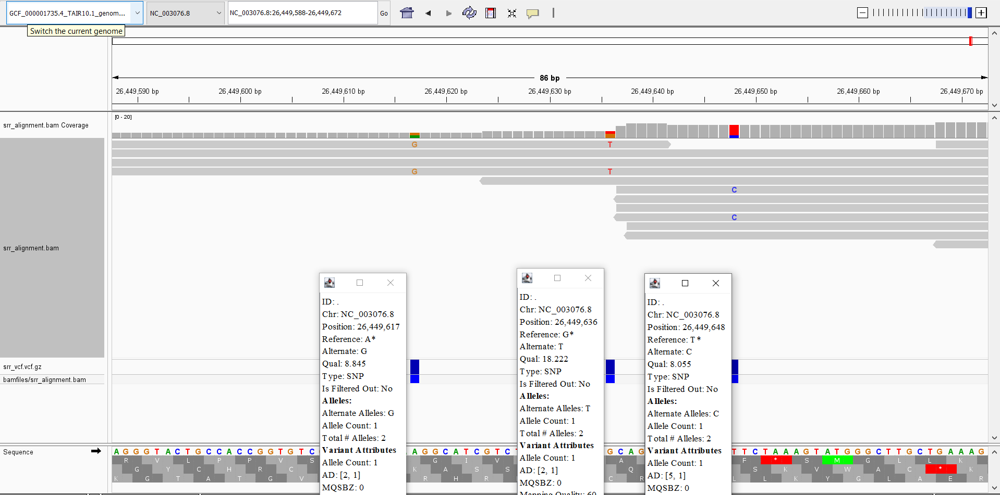
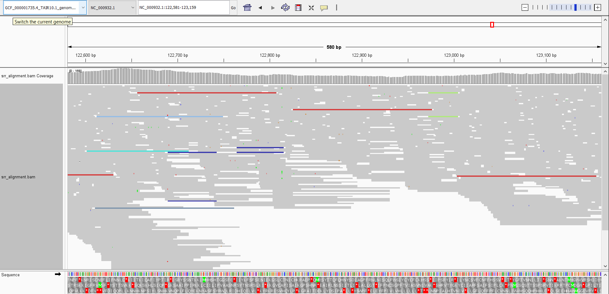
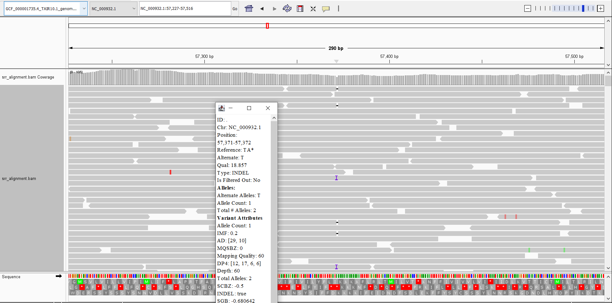
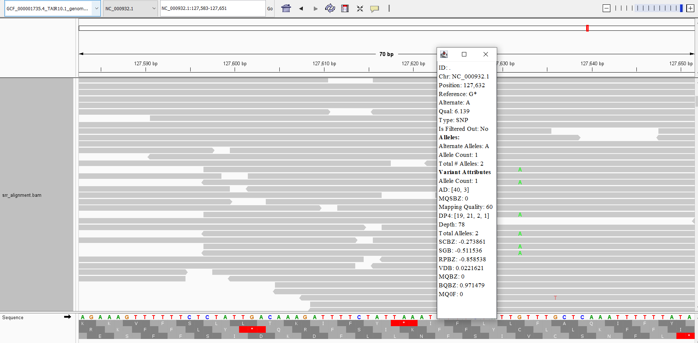

# Week 10: Generate a variant call file
**Assignment**: Call variants on the BAM file and discuss some information on the variants you found. Your eye is an excellent variant caller.Verify the variant caller's results by looking at a few example the alignments in the BAM file. Find examples where the variant caller did not work as expected: false positives, false negatives, etc.

I switched to an *Arabidopsis thaliana* dataset for this assignment, using the TAIR10.1 reference genome GCF_000001735.4 and SRR31238423 from a Joint Genome Institute (JGI) protocol development project PRJNA1177481. I updated my makefile with a target called `callvars` that runs all the necessary SRR bamfile making and a new `vcf` target as well. I upped the sampled coverage to 500,000 reads. Indexing took minutes, and with the higher coverage, so did making the bamfile... did I observe a few places with piles of reads (but I will try to find a better dataset next time).

I found this spot in the BAM file on chromosome 5 that looked like it had some kind of SNV, and when I loaded in the vcf, I saw it was denoted as a SNP

However as I looked through more of the locations I felt that coverage was simply too low in certain spots for accurate determination of if something was a SNP or not. This is a few places that seemed like false positives to me:

A cool feature of the TAIR10.1 GCF I used is that it includes 2 additional "chromosmes": one for mitochondrial and the other plastid DNA. I took a look and found so many reads mapped to plastid DNA. Even squished, the reads mapped quite densely, and I saw few variants in the vcf track. This is easily a place for false negatives. 

I mostly found INDELs like this one:

And this one SNP at the G, that to me reads as a false positive:

