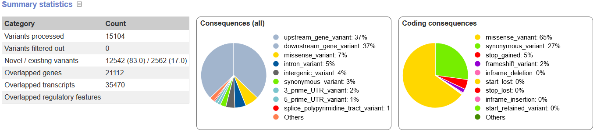
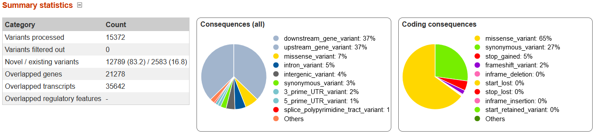

# Week 11: Establish the effects of variants

Evaluate the effects of the variants in your VCF file.

Try using a software tool like VEP or snpEff.  Add the effect prediction steps to your Makefile and make them part of the workflow.

If, for some reason, you can't make any of the variant effect prediction software work, you may use visual inspection via IGV to describe the effect of variants.

Find variants with different effects.

Write a markdown report that summarizes the process and your results.

___________________________

#### Process

I wanted to try to run the VEP from my own computer instead of online. I set up an environment for VEP and installed to be able to run it from command line and my Makefile based on these [steps](https://www.biostarhandbook.com/appbio/methods/vep/). 

```bash
# Create a new conda environment for VEP
micromamba create -y -n vep perl perl-dbi perl-lwp-simple perl-dbd-mysql perl-bio-db-hts

# Activate the environment
micromamba activate vep

# Make a directory for sources
mkdir -p ~/src

# Change to the source directory
cd ~/src

# Clone the VEP repository
git clone https://github.com/Ensembl/ensembl-vep

# Change to the VEP directory
cd ensembl-vep

# Install the VEP package
perl INSTALL.pl --NO_HTSLIB --NO_TEST

# Verify the installation
./vep --help
```

But upon my installation attempt I got
 ```
 ERROR: Unable to unpack file ./Bio/tmp/release-1-6-924.zip without Archive::Extract or tar/unzip/gzip
```

and the final command to verify installation failed as well. Attempted to troubleshoot this a bit, but could not figure out what to do for now. Trying snpEff instead for now. 


```bash
#Check if snpEff database has Arabidopsis thaliana
snpEff databases > temp.txt
cat temp.txt | grep "Arabidopsis"
```

It has, but I couldn't figure out which assembly it has. So finally I resorted to Plant Ensembl's web VEP which clearly used TAIR10. Previously I had used TAIR10.1 (more recent assembly) as my reference but I re-ran my Makefile with GCF_000001735.3, the RefSeq ID for TAIR10.

#### Results

Out of curiosity at the difference, I looked at the results for both the TAIR10.1 and the TAIR10-based vcf files to compare. 

TAIR10.1 (VEP reference TAIR10 doesn't match):



TAIR10 (VEP reference TAIR10 matches):
 

The consequences charts have no difference in percentages, but the various counts in the table do differ slightly, on the order of ~200. 