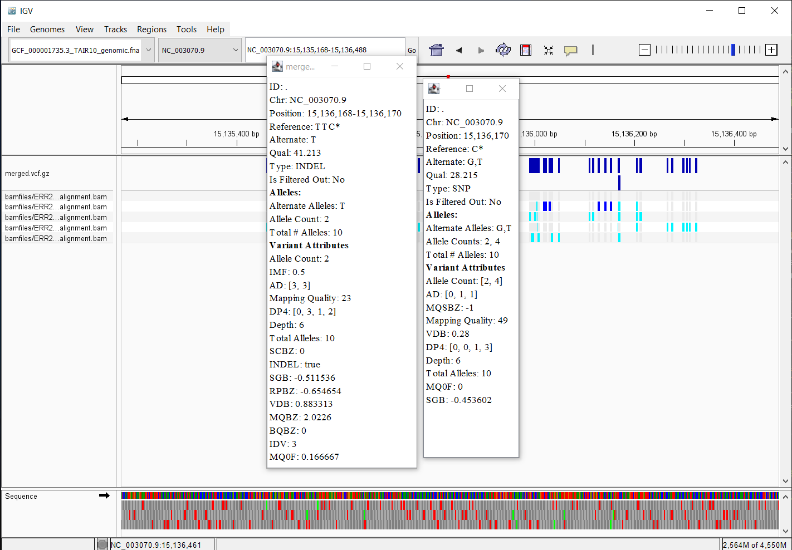

# Week 12: Automate a VCF calling pipeline


1. Create a Makefile that can produce a VCF file by downloading a reference genome, indexing it, and then downloading fastq files from SRA, aligning them to the reference and calling variants.
2. Create a README.md file that explains how to run the Makefile
3. Collect a set of samples from the SRA database that match your genome.
4. Create a design.csv file that lists the samples to be processed.
5. Using GNU parallel or any other method of your choice run the Makefile on all (or a a subset) of the samples
6. Merge the resulting VCF files into a single one.
7. Discuss what you see in your VCF file.


#### Steps 1 and 2: Running the Makefile to obtain a vcf
I started by updating my old Makefile to just have the VCF pipeline steps, so now after activating the `bioinfo` environment, `make all` runs all the steps from start to finish for variant calling once. If you have a genome downloaded and indexed, `make runvcf` just downloads reads from an SRA, trims them, aligns, and makes the vcf. I modified the targets to ensure that each vcf gets saved because they are not uniquely named.


#### Steps 3 and 4: Samples for processing
Using filters for Arabidopsis thaliana and the Genome strategy in the NIH SRA, I collected a set of 5 samples to process. The information I used in the file was the project name, dataset accession, and the run id:

```
Project Name    Run
PRJEB23122      ERX2235127      ERR2178816
PRJEB23122      ERX2235126      ERR2178815
PRJEB23122      ERX2235125      ERR2178814
PRJEB23122      ERX2235108      ERR2178797
PRJEB23122      ERX2235078      ERR2178767
```

#### Step 5: Using GNU parallel

Checked commands with
```bash
cat design.csv | parallel --dry-run --colsep , --header : make runvcf SRR={Run}
```
and saw that I accidentally made a tab delimited file, so I fixed my design.csv and ran the `--dry-run` again to see it fixed. 

Overall: I ran the pipeline by doing `make genome` and `make index` first, and then running the vcf-making steps as the command above, without the dry run tag. 

#### Steps 6 and 7: Merging and observing the vcf files

I attempted to merged the vcf files as per instructions, but realized I needed to add indexing to the pipeline, so did that. I also added a target `mergevcf` to the makefile for esay running another time. Then I viewed it in IGV against the genome.

In the merged track, places with bars stacked up like below showed different types of variants.

