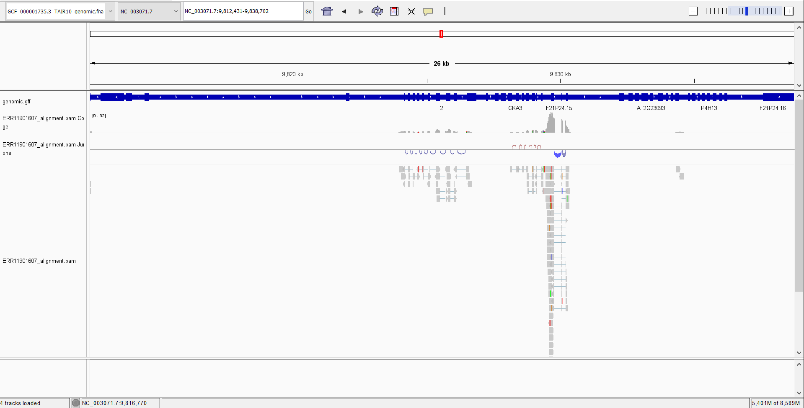

# Week 13: Generate an RNA-Seq count matrix.
Your submission should include a readme, a makefile, and a design file.

1. You may re-use code and genomes from your previous submission. You will need a genome and a GTF/GFF annotation reference. You may also perform a transcriptome-based quantification if you choose.
2. For your genome of interest, find RNA-Seq data at SRA. Most RNA-Seq projects include multiple datasets. Select at least three SRR datasets from the same project.
3. Write code to perform an RNA-Seq analysis on each dataset. The final result of your code should be a count matrix that summarizes read counts for each dataset.
4. Include screenshots from IGV that prove that your data is indeed RNA-Seq data. 
5. Discuss a few lines of the resulting count matrix. Visually identify rows where the counts show consistent gene expression levels.


#### Step 1: Update Makefile to get gff
I have not had a chance to clean up the Makefile to move elements to the top yet as per comments on the previous assignment, but will be working on that later. I updated the `genome` target to have the flag `--include genome,gff3` when it downloads from NCBI.

#### Step 2: Select RNA-seq data
I found a cool recent dataset in Arabidopsis that is related to my biological process of interest: PRJEB65483 - "RNA-seq experiment of tissue forming a lateral root after salt treatment in cyp79b2/b3 mutants containing multiple timepoints". The naming convention was unintelligible, but luckily data was annotated at the SRA run selector: https://www.ncbi.nlm.nih.gov/Traces/study/?acc=ERP150612&o=acc_s%3Aa. I don't care about their mutant so I selected just the WT plants treated with and without NaCl at whatever "5em" developmental stage means. I made design.csv to have the selected SRR numbers, also shown below:

```
Project,Genotype,Treatment,Name,Run
PRJEB65483,WT,none,A8_p,ERR11901607
PRJEB65483,WT,none,A16_p,ERR11901578
PRJEB65483,WT,none,A39_p,ERR11901592
PRJEB65483,WT,NaCl,A11_p,ERR11901573
PRJEB65483,WT,NaCl,A25_p,ERR11901583
PRJEB65483,WT,NaCl,A51_p,ERR11901600
```

#### Step 3: Code RNA-Seq analysis
Updating the makefile to index the genome for RNA-Seq analysis with 

```bash
hisat2-build ${GENPATH}/*.fna ${GENPATH}/${REFSEQID}-index
```

I know *.fna can be dangerous but trying to make the process work first for now.

Edited the align target to work with hisat2:

```bash
hisat2 -x ${GENPATH}/${REFSEQID}-index -1 ${R1} -2 ${R2} | \
		samtools sort > ${dirBAM}/${BAM}
```

Added target `getalign` to run `getreads` and `align` in succession. Then added `counts`.

When running on the made bam files, the output included this warning I could not quite figure out
```
Warning: failed to find the gene identifier attribute in the 9th column of the provided GTF file.
The specified gene identifier attribute is 'gene_id'
```
I dug around a bit on forums for that error and found: https://help.galaxyproject.org/t/featurecounts-error-using-a-gene-annotation-from-a-gff3-file/10633/2

and checked the `featureCounts` help to see

```
-t <string>         Specify feature type in GTF annotation. 'exon' by
                      default. Features used for read counting will be
                      extracted from annotation using the provided value.

  -g <string>         Specify attribute type in GTF annotation. 'gene_id' by
                      default. Meta-features used for read counting will be
                      extracted from annotation using the provided value.
```

I adjusted my command and was able to get my counts matrix. 

I then set up a parallel run to get all six SRRs aligned and indexed:

```bash
cat design.csv | parallel --colsep , --header : make getalign SRR={Run}
```
Then ran `make counts` to get the matrix for all six runs. It became annoying because I didn't name them in the way I wanted the matrix organized... will have to deal with that later, but for now, re-did it manually to check.

```bash
featureCounts -a ncbi_dataset/data/GCF_000001735.3/genomic.gff -t gene -g ID -o counts.txt bam/ERR11901607_alignment.bam bam/ERR11901578_alignment.bam bam/ERR11901592_alignment.bam bam/ERR11901573_alignment.bam bam/ERR11901583_alignment.bam bam/ERR11901600_alignment.bam
```

#### Step 4: Check RNA-seq-ness of data
The below screenshot shows reads primarily in the exon regions, though it does seem a bit messy with some reads aligning right outside, I am unsure as to why. 



#### Step 5: Visually inspect count matrix
The below genes seemed to have some consistencies across the first three (untreated) and the next three (NaCl). I think I need to increase the number of reads to get a better idea though.

gene442	NC_003070.9	1188995	1191458	-	2464	282	244	296	459	505	480

gene494	NC_003070.9	1340553	1343793	-	3241	8	4	5	16	18	10

gene948	NC_003070.9	2524023	2526322	+	2300	60	47	22	371	492	181

gene27098	NC_003075.7	11646109	11648644	-	2536	322	385	412	268	239	218
